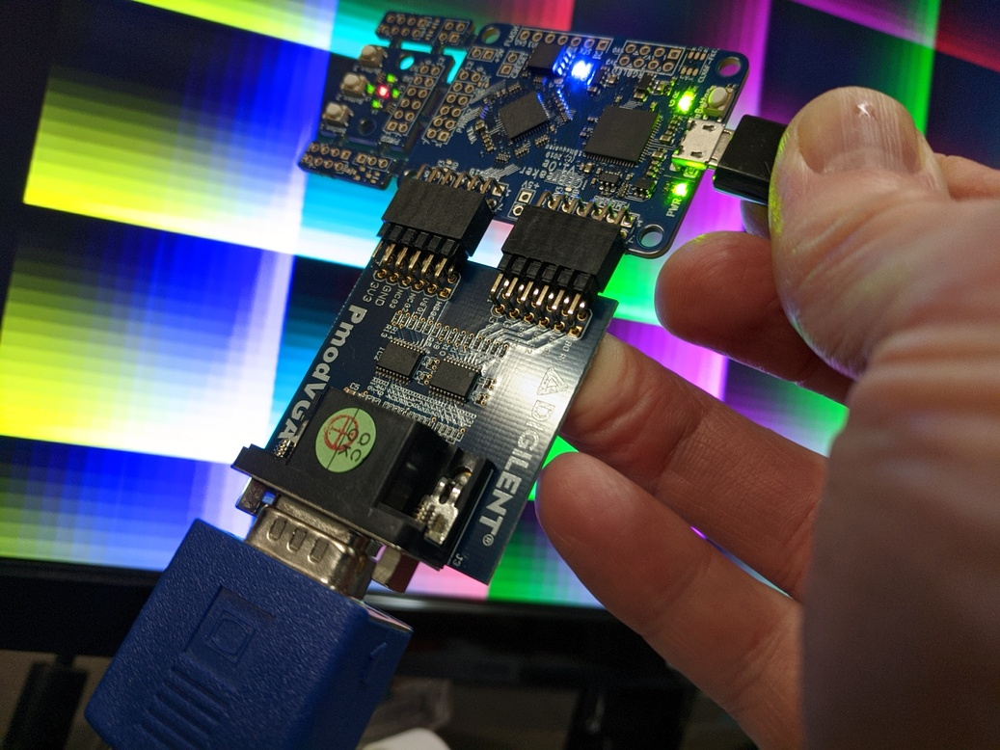

```
This is an example design for driving the 12b VGA PMOD module from
Digilent. The design drives 800x600 video with a 40 MHz input clock.
The actual video is an alternating display of:
   1) Color Test Pattern grid.
   2) Bouncing dot with changing colors ( Pong'ish ).
   3) Moving lines.

vga-12bit.v  : top level for FPGA design.
vga_core.v   : Generates color test pattern, bouncing ball and moving lines.
vga_timing.v : Generates low level VGA timing for 800x600 with 40 MHz clock.

Kevin M. Hubbard @ Black Mesa Labs 2017.12.14

Tim Callahan @Google Icebreaker version for Digilent VGA PMOD, based on dvi-12bit design  2020.12.31
```




